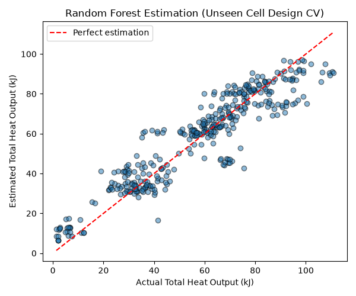
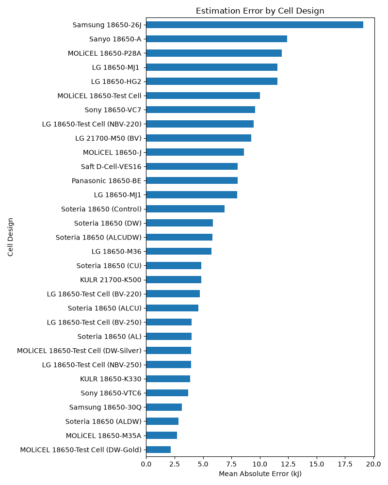

# Battery Thermal Runaway Benchmark

**Question:** From cell metadata and ejected mass alone, how well can we estimate the total heat released in a Li-ion thermal runaway, and does the model hold up on unseen cell designs?

**Data Citation:** Finegan et al., *J. Power Sources* 597 (2024) 234106, doi:10.1016/j.jpowsour.2024.234106. Note that the data licence is CC BY-NC-ND, so the raw dataset is NOT redistributed in this repository. Download the spreadsheet from NREL/NASA yourself to reproduce these results.

**Run:** `cd benchmark` then `python bfd_benchmark.py ../battery-failure-databank-revision2-feb24.xlsx "Battery Failure Databank"`
(Dependencies are pinned in `benchmark/requirements.txt`. Tested with Python 3.12).

**Method:** Mean baseline vs ridge vs random forest; evaluated using 10 repeats of 5-fold group CV by cell design (each test fold contains completely unseen cell designs). 

**Tiers of features evaluated:**
*   **Tier A (Pre-test only):** Only specifications known before the test (e.g. `Cell-Capacity-Ah`, `Cell-Nominal-Voltage-V`, `Cell-Energy-Wh`, pre-test mass, casing thickness, trigger mechanism). Tier A strictly uses **no ejected mass**. We tested this with and without the identifiers `Test-Series` / `S-FTRC-Generation`.
*   **Tier B (Pre-test + Trigger setup):** Tier A plus `Heater-Power-W`, `Heater-Time-On-s`, `Avg-Cell-Temp-At-Trigger-degC`, `Energy-Applied-to-Trigger-kJ`.
*   **Tier C (Full available features):** Tier B plus post-test measurements (`Post-Test-Mass-...` and `Cell-Failure-Mechanism`).

## Results (10 repeats of 5-fold group CV by cell design)

*Note: ± values represent standard deviation across splits, not a confidence interval.*

```
             Tier           Model              MAE               R2
  Tier A (No IDs) Baseline (mean) 21.787 +/- 4.820 -0.401 +/- 1.080
  Tier A (No IDs)           Ridge  9.465 +/- 2.213  0.594 +/- 0.297
  Tier A (No IDs)   Random forest  8.798 +/- 1.959  0.671 +/- 0.254
Tier A (With IDs) Baseline (mean) 21.787 +/- 4.820 -0.401 +/- 1.080
Tier A (With IDs)           Ridge  9.813 +/- 2.587  0.562 +/- 0.344
Tier A (With IDs)   Random forest  8.801 +/- 2.147  0.673 +/- 0.234
           Tier B Baseline (mean) 21.787 +/- 4.820 -0.401 +/- 1.080
           Tier B           Ridge  9.883 +/- 2.603  0.563 +/- 0.314
           Tier B   Random forest  9.142 +/- 2.066  0.652 +/- 0.256
           Tier C Baseline (mean) 21.787 +/- 4.820 -0.401 +/- 1.080
           Tier C           Ridge  7.033 +/- 1.608  0.806 +/- 0.221
           Tier C   Random forest  7.211 +/- 1.573  0.801 +/- 0.133
```

As shown, the models can estimate total heat yield for unseen cell designs using only metadata (Tier A) with an R² of ~0.67. Tier B showed no improvement over Tier A. However, including post-test measurements (Tier C) adds a lot of explanatory power, raising R² to ~0.80, with Ridge and Random Forest performing about equally well.

### Visualizations
*Plot 1 shows Estimated vs Actual heat output for the Random Forest model using Tier C features.*


*Plot 2 shows the Mean Absolute Error for the same model (Tier C Random Forest) broken down by cell design.*


## Limitations
Small dataset (~365 samples), limited number of distinct cell designs (~31 designs), lab calorimeter conditions (not data-center racks), no claim of novelty: this is a benchmark and replication exercise. Estimations apply exclusively to unseen cell designs *within the distribution of this dataset*, and we do not make claims beyond it.
